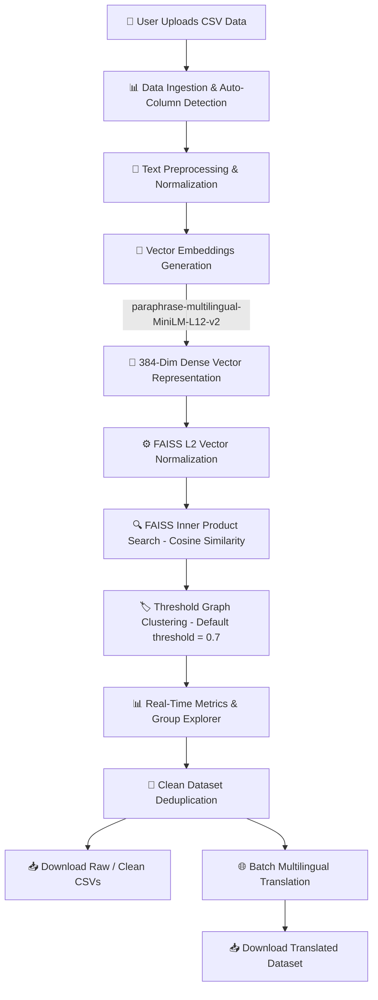

# 🌍 Multilingual Semantic Duplicate Detector & Deduplication Engine

An AI-powered, high-performance web application built with **Streamlit**, **Sentence-Transformers**, **FAISS (Facebook AI Similarity Search)**, and **Deep-Translator**. 

This system detects and groups duplicate records across 50+ languages using dense vector embeddings and semantic similarity matching, enabling automated dataset deduplication, interactive exploratory comparison, and batch translation.

---

## 🌟 Key Features

- **🌐 Cross-Lingual Semantic Matching**: Matches duplicates across languages (e.g., matching English *"Apple"*, Japanese *"りんご"*, and Hindi *"सेब"*) using multilingual Transformer models.
- **⚡ High-Speed Vector Indexing**: Employs **FAISS (`faiss-cpu`)** with L2-normalized Inner Product similarity (Cosine Similarity) for sub-millisecond similarity retrieval.
- **📊 Interactive Streamlit Dashboard**: User-friendly UI for CSV dataset upload, real-time data preview, progress tracking, and interactive group exploration.
- **📈 Real-Time Analytics & Metrics**: Tracks total records, deduplicated clean count, processing speed (`rec/sec`), embedding generation time, and detection time.
- **🔎 Visual Group Explorer & Pairwise Comparison**: Inspect flagged duplicate clusters with side-by-side pairwise text comparisons (`Text A ↔ Text B`).
- **🧹 One-Click Dataset Deduplication & Export**: Instantly remove duplicate records and export raw results (`duplicate_results.csv`) or clean datasets (`clean_dataset.csv`).
- **🌐 Multilingual Translation Pipeline**: Translate deduplicated datasets into target languages (English, Hindi, Japanese, German, French, Spanish) on demand.

---

## 🔄 Detailed System Architecture & Workflow



### Detailed Workflow Steps:

1. **Data Ingestion & Parsing**: The user uploads any CSV file via the Streamlit interface. The app automatically detects text columns (looking for `text` or defaulting to the primary content column).
2. **Text Preprocessing**: Input strings are sanitized by trimming whitespace, casting to lower-case string representations, and extracting target text sequences.
3. **Multilingual Embedding Generation**: Texts are passed into the `paraphrase-multilingual-MiniLM-L12-v2` transformer model (via `@st.cache_data` for performance) to generate 384-dimensional dense semantic vector representations.
4. **FAISS Vector Indexing & Similarity Matching**:
   - Embeddings are converted to `float32` arrays.
   - `faiss.normalize_L2` normalizes vectors to unit length.
   - A `faiss.IndexFlatIP` (Flat Inner Product) index is built.
   - Top-$k$ ($k=5$) nearest neighbors are searched for each record.
5. **Graph / Cluster Grouping**: Neighbor pairs exceeding the cosine similarity threshold (default `0.7`) are assigned unified duplicate group IDs (`group_id`).
6. **Exploration & Analytics**: Users explore flagged duplicate clusters, inspect pairwise similarities, and view execution speeds.
7. **Deduplication & Export**: Duplicate groups are reduced to distinct single entries, offering instant CSV download options for raw and cleaned datasets.
8. **Optional Translation**: Cleaned records can be translated into target languages using `deep-translator` (`GoogleTranslator`) with customizable row sampling limits.

---

## 📁 Project Directory Structure

```
intovectorvalue/
├── app.py                                # Main Streamlit web application & UI workflow
├── model.py                              # Sentence-Transformers embedding model handler
├── utils.py                              # FAISS indexing, vector normalization & clustering logic
├── translator.py                         # GoogleTranslator batch translation pipeline
├── requirements.txt                      # Project dependencies specification
├── data.csv                              # Sample multilingual dataset (English, Japanese, Hindi)
├── Book2.csv                             # Alternative sample CSV dataset
└── ultra_complex_multilingual_dataset.csv # Comprehensive test dataset (~4.7 MB)
```

---

## 🛠️ Technology Stack

| Component | Technology | Description |
| :--- | :--- | :--- |
| **Frontend UI** | [Streamlit](https://streamlit.io/) | Interactive web dashboard and visual analytics |
| **NLP Embeddings** | [Sentence-Transformers](https://www.sbert.net/) | `paraphrase-multilingual-MiniLM-L12-v2` |
| **Vector Search** | [FAISS (`faiss-cpu`)](https://github.com/facebookresearch/faiss) | Facebook AI Similarity Search index for cosine similarity |
| **Translation** | [Deep-Translator](https://github.com/nidhaloff/deep-translator) | Automated Google Translate API integration |
| **Data & Vectors** | Pandas & NumPy | High-performance array operations and CSV processing |
| **Deep Learning** | PyTorch | Underlying framework for Sentence-Transformer models |

---

## ⚙️ Installation & Setup

### 1. Prerequisites
Ensure you have Python 3.10+ installed on your system.

### 2. Clone Repository & Navigate
```bash
cd "d:/Clg report/intovectorvalue"
```

### 3. Install Dependencies
Install all required Python packages listed in `requirements.txt`:
```bash
pip install -r requirements.txt
```

*Required packages include:*
```text
streamlit
pandas
scikit-learn
sentence-transformers
faiss-cpu
torch
torchvision
deep-translator
```

---

## 🚀 Running the Application

Launch the Streamlit dashboard using the following command:

```bash
streamlit run app.py
```

Or using a specific Python environment:
```bash
python -m streamlit run app.py
```

Once launched, open your web browser and navigate to:
- **Local URL:** `http://localhost:8501`

---

## 📖 Step-by-Step Usage Guide

1. **Upload Dataset**: Click **📂 Upload CSV** on the dashboard home screen and select a CSV file (e.g., `data.csv` or `ultra_complex_multilingual_dataset.csv`).
2. **View Data Preview**: Preview the first 500 rows of your dataset.
3. **Automatic Processing**:
   - Generating 384-dim embeddings across records.
   - Performing FAISS similarity search and threshold clustering.
4. **Inspect Metrics**: Review total records, clean records, embedding execution time, FAISS search time, and processing speed (`rec/sec`).
5. **Explore Duplicate Clusters**: Select a duplicate group ID from the **🔎 Group Explorer** dropdown to view all items in that group and their pairwise comparisons.
6. **Export Clean Dataset**: Click **🧹 Generate Clean Dataset** to preview and download deduplicated CSV files (`clean_dataset.csv`).
7. **Translate Clean Data**: Select a target language (English, Hindi, Japanese, German, French, Spanish), adjust row limits, and click **🌐 Translate Clean Data** to view and download translated results.

---

## 🔧 Configuration & Tuning Parameters

- **Similarity Threshold**: Located in [`utils.py`](file:///d:/Clg%20report/intovectorvalue/utils.py#L4) (`threshold=0.7`). Increase threshold (e.g., `0.85`) for stricter duplicate matching; decrease (e.g., `0.60`) for broader semantic grouping.
- **K-Nearest Neighbors**: Located in [`utils.py`](file:///d:/Clg%20report/intovectorvalue/utils.py#L18) (`k=5`). Adjust neighbor depth per vector search.
- **Embedding Batch Size**: Located in [`model.py`](file:///d:/Clg%20report/intovectorvalue/model.py#L7) (`batch_size=128`).

<!-- Repository maintained by Kaifkhan1212 -->
